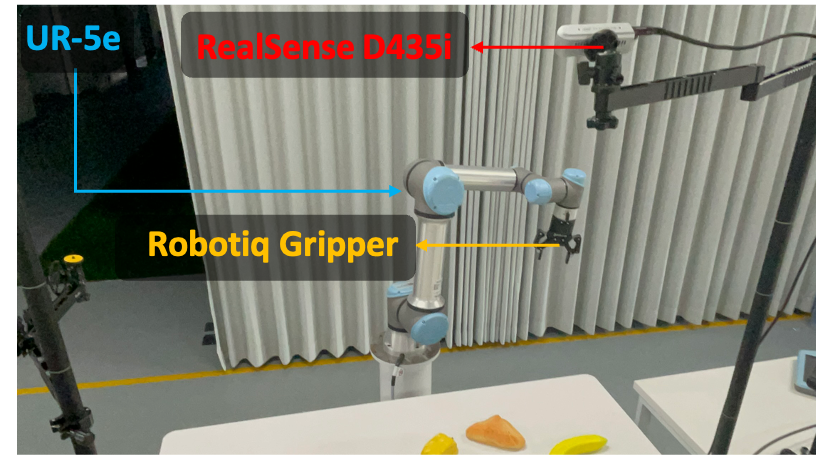
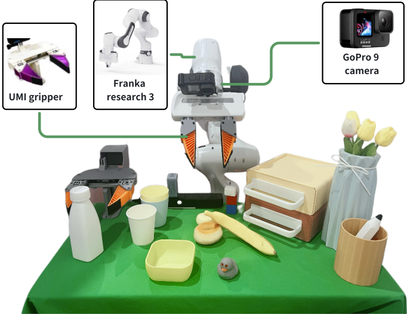

# robotics-data-collection-setup

## Robotic Arm Data Collection Setup Comparison

| Paper Title | Robot Brand| Sensor Type | Image |
|-------------|-------------|-------------|-------|
| ReKep [[link]](https://arxiv.org/pdf/2409.01652)     | Franka    | two rgb-d |  |
| Rekep [[link]](https://arxiv.org/pdf/2409.01652)     | Franka | three rgb-d |  |
| RoboMIND [[link]](https://x-humanoid-robomind.github.io/)     | UR5    | one Realsense D435i |  |
| RoboMIND [[link]](https://x-humanoid-robomind.github.io/)     | Franka | three Realsense D435i |  |
| BridgeData V2 [[link]](https://rail-berkeley.github.io/bridgedata/)     | WindowX 250 | one D435 and two C920 |  |
| TinyVLA [[link]](https://tiny-vla.github.io/)     | Franka    | two Zed |  |
| TinyVLA [[link]](https://tiny-vla.github.io/)     | UR5    | three D435i |  |
| PointVLA [[link]](https://arxiv.org/pdf/2503.07511v1) | UR5e | two D435i and one L515|  |
| ObjectVLA [[link]](https://arxiv.org/pdf/2502.19250v2) | Franka | one D435i and two Zed|  |
| LLARA [[link]](https://arxiv.org/pdf/2406.20095v3) | Franka | one RGB camera|  |
| 3D Diffusion Policy [[link]](https://arxiv.org/pdf/2403.03954) | Franka | one L515|  |
| MoLe-VLA [[link]](https://arxiv.org/pdf/2503.20384v1) | Franka | Gopro 9|  |
| Dita [[link]](https://arxiv.org/pdf/2503.19757v1) | Franka | D435i|  |

